# Architecture

One page on how content becomes the static site. Conventions, the content
schema, and gotchas are in `CLAUDE.md`; the editing and publishing workflow is
in `docs/EDITING.md`.

## Data flow: content → lib → pages → export

```
content/library/*.md ─┐
content/practice/*.md ─┤   src/lib/*            src/app/**/page.tsx        next build
src/config/*.ts ───────┼─► loaders, renderer, ─► server components, ───► out/ (static
public/images/** ──────┘   deadline rules,       JSON-LD, metadata         HTML + assets)
                           SEO builders
```

1. **Config** (`src/config/`) is the source of truth for everything that is
   not prose: firm facts and nav (`site.ts`), the nine practice areas
   (`practice-areas.ts` + `practice/<slug>.ts`), the four attorneys
   (`team.ts` + `team/<slug>.ts`), courts and cities (`service-areas.ts`),
   retired URLs (`redirects.ts`), FAQ and testimonials. Each list is
   count-checked at import time, so a missing entry fails the build instead of
   silently dropping a page.
2. **Content** (`content/`) is markdown: library articles with frontmatter,
   practice-page prose as `## ` sections. `src/lib/frontmatter.ts` parses
   `key: value` lines; `src/lib/markdown.ts` renders a deliberate subset of
   markdown to HTML with heading ids; `markdown-sections.ts` splits an article
   at `## ` headings to pull out the FAQ, the CTA, and the search text.
3. **Loaders** (`src/lib/library/articles.ts`, `src/lib/practice.ts`) read the
   files at build time, validate them (schema, category, author, em dashes,
   the closing disclaimer), and throw with the file name on any violation.
   Articles are cached once per build and sorted newest first.
4. **Pages** (`src/app/`) are server components that call the loaders and
   config, build metadata through `src/lib/seo/metadata.ts`, and emit JSON-LD
   through `src/lib/seo/jsonld.ts`. `generateStaticParams` enumerates
   articles, attorneys, and redirect stubs. The only client components are the
   library search, the deadline wizard, the consult flow, and the menus.
5. **Export**: `next build` with `output: 'export'` writes `out/`. Route
   handlers marked `force-static` produce `sitemap.xml`, `robots.txt`,
   `llms.txt`, and `library/index.json` as plain files. `scripts/check-links.mjs`
   and `scripts/check-seo.mjs` run over `out/` as gates.

## The deadline wizard

`src/components/wizard/` is the UI (steps config, state in `localStorage`,
results, the consult request panel). `src/lib/deadlines/` is the pure logic:
`rules.ts` and `rules-contests.ts` declare each rule (who it applies to, its
clocks, its copy), `compute.ts` runs the clocks and picks the later date when
a rule has two, `dates.ts` does calendar math and the CCP § 12a roll to the
next court day using `holidays.ts`, and `summary.ts` phrases where each
deadline stands on its result card. `RULES.md` records the statute text each
rule was checked against. All of it is unit-tested with Vitest.

## The article pipeline

Articles are written outside the repo, validated on the way in, given a
cover, and only then reach the build.

```mermaid
flowchart LR
  A["~/projects/rothrock-legal/redesign/articles/<slug>.md<br/>(+ <slug>-VERIFICATION.md)"]
  B["scripts/import-articles.mjs<br/>schema, category, author, banned words,<br/>em dashes, FAQ + CTA sections, description ≤ 155"]
  C["content/library/<slug>.md"]
  D["scripts/make-covers.mjs<br/>public/images/library/<slug>.webp (1200×675)"]
  E["src/lib/library/articles.ts<br/>parse, validate, render, split FAQ"]
  F["src/app/library/[slug]/page.tsx<br/>src/app/library/page.tsx<br/>index.json, sitemap, llms.txt"]
  G["next build → out/"]
  A -->|"node scripts/import-articles.mjs"| B
  B -->|"valid"| C
  B -.->|"invalid: listed, exit 1"| A
  C -->|"node scripts/make-covers.mjs"| D
  C --> E
  D --> E
  E --> F
  F -->|"env -u NODE_ENV npm run build"| G
```



Notes on the pipeline:

- The import script reads the allowed authors and categories from
  `src/config/team/` and `src/types/content.ts`, so the two cannot drift.
  Verification files (`*-VERIFICATION.md`) are skipped, never imported.
- `make-covers.mjs` is idempotent: it only generates covers that are missing
  (`--force` regenerates), only for articles whose `image` is under
  `/images/library/`.
- `draft: true` articles are built and linked, but tagged, `noindex`, and left
  out of `sitemap.xml` and `llms.txt`. `LIBRARY_HIDE_DRAFTS=1` removes them
  from a build entirely.
- The search index (`/library/index.json`) is the list items plus the body
  text with the FAQ, CTA, and disclaimer stripped, so boilerplate cannot match
  every query. The route throws if the count does not equal the article
  count.

## Redirects

Every retired URL is a key in `src/config/redirects.ts`. The catch-all route
`src/app/[...legacy]/page.tsx` turns each key into a static page with a
relative `meta http-equiv="refresh"` to the new URL, a canonical to it, and
`noindex`. Relative targets mean the stubs work at any basePath.
